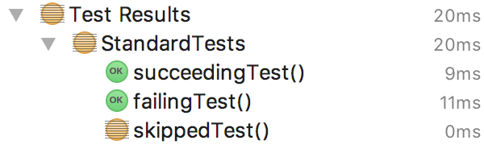
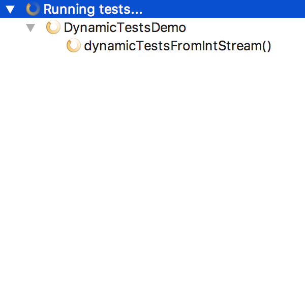
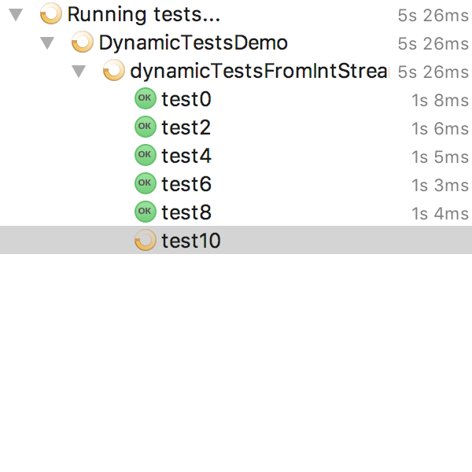
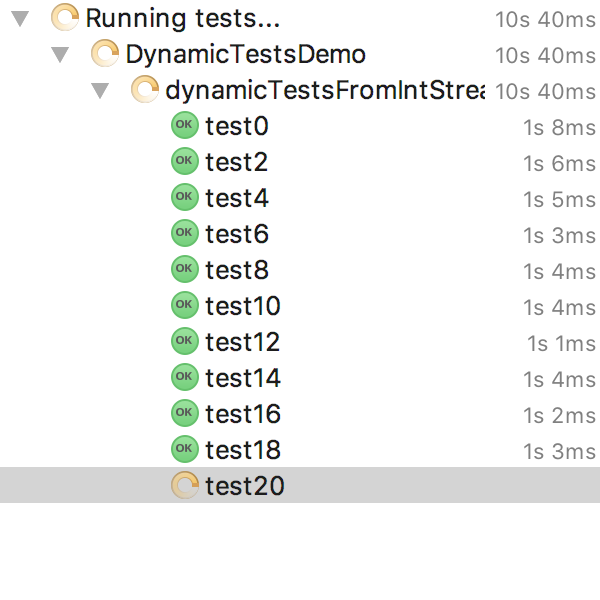

autoscale: true
slidenumbers: true

# Static vs. Dynamic Tests

---

# Static Tests

```java
class StandardTests {

	@Test
	void succeedingTest() {
	}

	@Test
	void failingTest() {
		fail("a failing test");
	}

	@Test
	@Disabled("for demonstration purposes")
	void skippedTest() {
		// not executed
	}
}
```

---




---

# Static Tests

- fully specified at compile time
- no way to programmatically add tests at runtime

---

# Dynamic Tests

```java
class DynamicTestsDemo {
	@TestFactory
	Stream<DynamicTest> dynamicTestsFromIntStream() {
		return IntStream.iterate(0, n -> n + 2).limit(10).mapToObj(
			n -> dynamicTest("test" + n, () -> {
				assertTrue(n % 2 == 0);
			}));
	}
}
```

`@TestFactory` method must return a `Stream`, `Collection`, `Iterable`, or `Iterator` of `DynamicTest` instances.

---





---

# Why Dynamic Tests?

Use plain old Java and lambdas to generate _dynamic_ tests at runtime

- for a set of parameters
- based on data in other files
- using random data
- using environment variables
- depending on the operating system
- etc.
